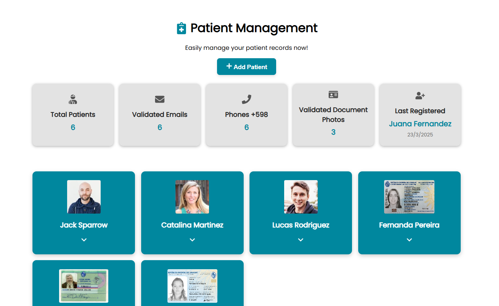
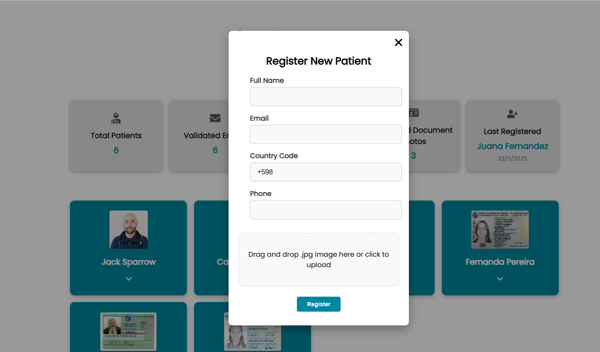
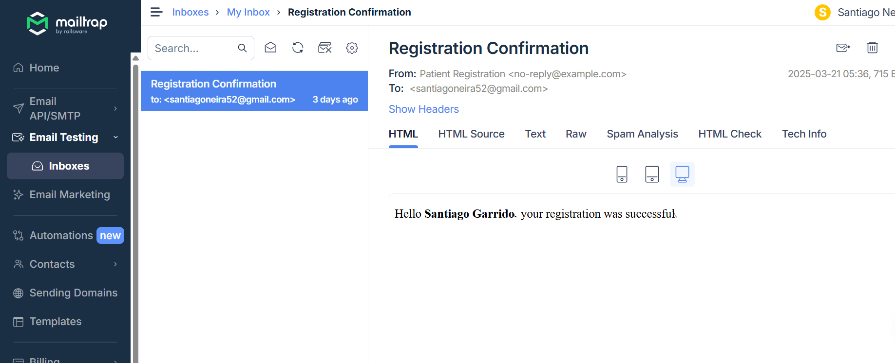
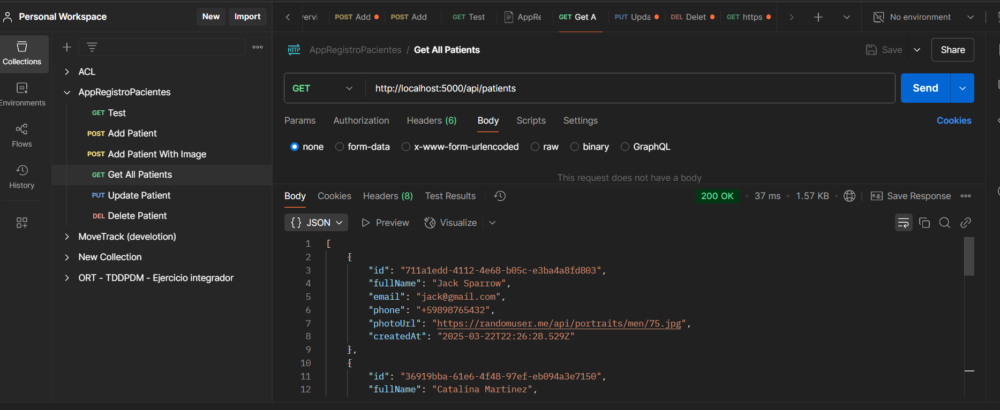

¡Perfecto! Aquí tenés una versión actualizada en inglés, con instrucciones claras, un apartado para capturas y un estilo profesional:

---

# 🏥 Patient Registration App

A full-stack application to register and manage patients, built with **Node.js**, **Express**, **PostgreSQL**, and **Prisma ORM**, running in Docker containers. It includes a modern frontend with **React**, and offers document photo upload and email validation.

---

## 📸 Demo






---

## 🚀 Tech Stack

- **Backend:** Node.js + Express
- **Frontend:** React + Vite
- **Database:** PostgreSQL
- **ORM:** Prisma
- **Containerization:** Docker + Docker Compose
- **Environment Management:** dotenv
- **File Uploads:** Multer
- **Email Service:** Mailtrap (future implementation)

---

## 📁 Project Structure

```
├── backend/
│   ├── controllers/
│   ├── routes/
│   ├── middlewares/
│   ├── prisma/
│   ├── services/
│   └── server.js
├── frontend/
│   ├── components/
│   ├── pages/
│   ├── styles/
│   └── main.tsx
├── docker-compose.yml
├── .env.example
├── README.md
```

---

## 🛠️ Getting Started

### 1️⃣ Clone the repository
```bash
git clone <REPOSITORY_URL>
cd project-root
```

### 2️⃣ Setup environment variables

Copy the `.env.example` file and fill in your config:

```bash
cp .env.example .env
```

### 3️⃣ Start the app using Docker
```bash
docker-compose up --build
```

This will spin up:
- 🐘 PostgreSQL database
- 🚀 Node.js backend
- ⚛️ React frontend (Vite)

Visit your app at:  
`http://localhost:5173`

---

## 🧪 Seed Data

The app comes with 3 demo patients already created with ID document images. You can modify or reset this in `prisma/seed.ts`.

To apply seed manually:

```bash
docker exec -it backend_api npx prisma db seed
```

---

## 🔐 Environment Variables

Create a `.env` file with:

```dotenv
DATABASE_URL=postgresql://postgres:postgres@db:5432/patients_db
PORT=5000
MAIL_HOST=...
MAIL_PORT=...
MAIL_USER=...
MAIL_PASS=...
```

> ⚠️ **Do not commit `.env` to version control.**  
> You can add `.env.example` to show required keys.

---

## 📦 Useful Commands

### Run migrations
```bash
docker exec -it backend_api npx prisma migrate dev --name init
```

### View logs
```bash
docker logs -f backend_api
```

### Stop containers
```bash
docker-compose down
```

---

## 🧪 API Endpoints

### ➕ Create patient

**POST** `/api/patients`  
Content-Type: `multipart/form-data`

**Fields:**
- `fullName`
- `email`
- `phone`
- `photoUrl` (.jpg file)

---

### 📥 Get all patients

**GET** `/api/patients`  
Returns all registered patients.

---

## 🙋‍♂️ FAQ

**Do I need Docker to run this app?**  
No. You can run it locally if you have Node.js and PostgreSQL installed.

**Where can I preview the emails sent?**  
Sign up at [Mailtrap.io](https://mailtrap.io/), and insert your SMTP credentials in `.env`.

---
